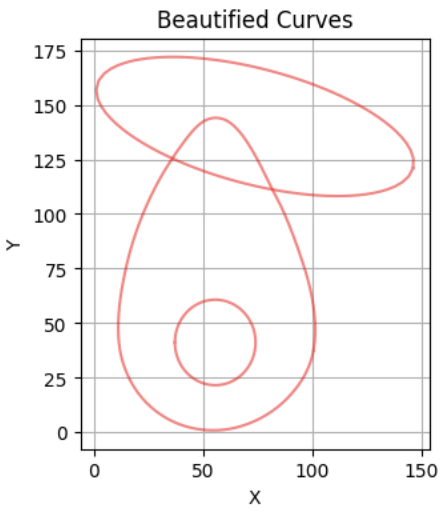
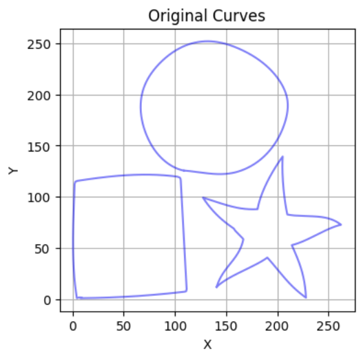
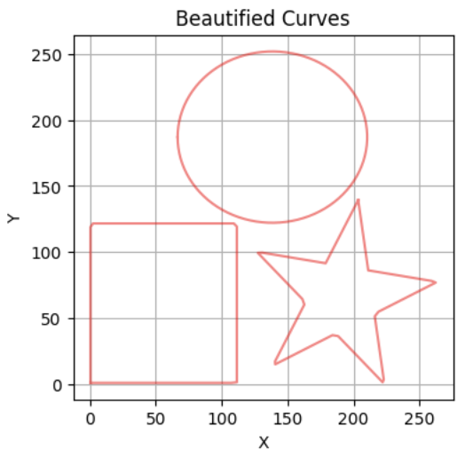
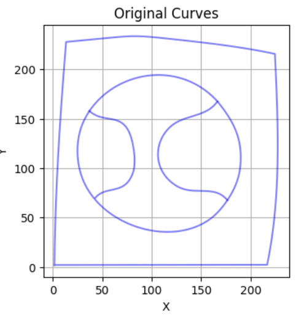
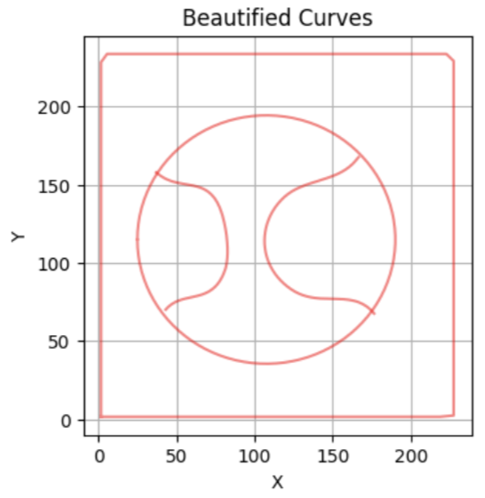

Curvetopia 🌈

Welcome to Curvetopia, a project born out of the Adobe Gensolve Hackathon, where curves aren't just shapes—they're art! This repository showcases my approach to identifying, regularizing, and beautifying a wide array of 2D curves. Whether you're a geometry enthusiast, a coding wizard, or someone who appreciates the elegance of symmetry, Curvetopia offers something special for you.

🎯 Objective:

Our mission is simple yet ambitious: to bring order and beauty to the chaotic world of 2D Euclidean space. We're starting with closed curves and working our way up to more complex shapes. Along the way, we'll explore the mesmerizing world of symmetry and master the art of curve completion. In short, we're on a journey to make every curve a masterpiece.

Firsty we look into the regular curves i.e. lines, Square, Rectangle, Triangle, Ellipse, Pentagon, Hexagon, Heptagon, Octagon.

- **Identify**: Pinpoint those curves which closely resemble to the above mentioned regular shapes.
- **Regularize**: Transform irregular shapes into their ideal, symmetrical forms.
- **Beautify**: Replace imperfect curves with their perfectly aligned counterparts.
  
Our approach leverages the power of Shape Context to match and regularize curves. By creating bounding boxes around contours and aligning them using PCA (Principal Component Analysis), we achieve precise shape formation. Whether it's a square, ellipse, or any polygon, we've got it covered!

As you can see in "occlusion1.csv" the ellipse and circle are regularised, and occlusion is also perfectly handled.

As you can see in "isolated.csv" the square, circle and star are regularised perfectly.

💻 How It Works: Shape Identification, Regularization, and Code Highlights:
We begin by identifying shapes through their contours and comparing them with a set of reference shapes. This process involves matching and classifying each shape. If a match is found with a score below 10, the curve is replaced with a perfected version. For rectangles and ellipses, we align the bounding box along the PCA axis to achieve flawless symmetry.

Now we find the number of lines of symmetry present in irregular shapes ( assuming that if present they will be along the PCA axis)

We find the PCA major and minor axis for the irregular shapes
Now we flip the points of one side of the shape, and then perform hungarian matching with the points of the other side.
If the matching score comes out to be less than the threshold then we classify the line as the line of symmetry.
Finally the total number of lines of symmtery are printed.

